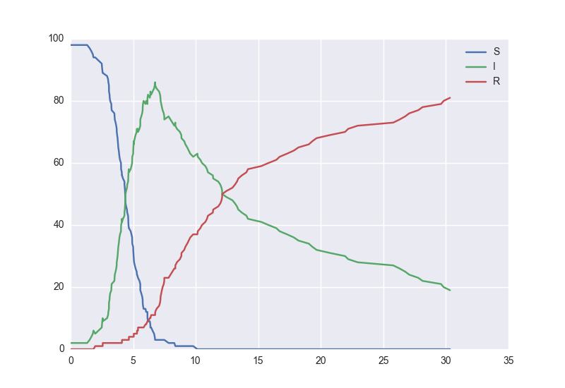

_scotch_ implements algorithms for **s**tochastic, **co**ntinuous-**t**ime **ch**ains, or 
Markov processes. We are currently in alpha release; contributions are welcome ! For pull 
requests or bug reports, find us on [Github](http://qcaudron.github.io/scotch). 

Stochastic systems are described by their state space and the transitions between them. _scotch_ 
can simulate ( we think... ) random walks, systems can be described by differential equations, 
and finite state machines, amongst other mathematical systems.

Both the package and documentation are in semi-active development - watch this space.


## Roadmap

#### Currently implemented :

- interactive "wizard" for full model specification
- Gillespie's algorithm
- tau-leaping algorithm
- a quick-plot method


#### For the future :

- adaptive timestepping in tau-leaping
- generating trace distributions with credible intervals
- parameter inference


## Quickstart


### Using the Wizard

Start by creating a model with the help of the wizard.

```
import scotch

model = scotch.model()
model.wizard()
```

We've created an SIR epidemiological with three state variables : `S`, `I`, and `R`. Individuals 
move from the susceptible state `S` to the infected class `I` at a rate proportional to `S` and 
`I` as the infection propagates, and then infected individuals move into the Recovered state `R` 
at a rate proportional to the number of individuals in `I`. 

We can then immediately simulate this system using the Gillespie algorithm and plot the results, 
up to some final time.

```
model.plot(30)
```




### Creating a _scotch_ model file

_scotch_ models are defined in JSON format. A complete _scotch_ model file can look like this :
```
File goes here
```
